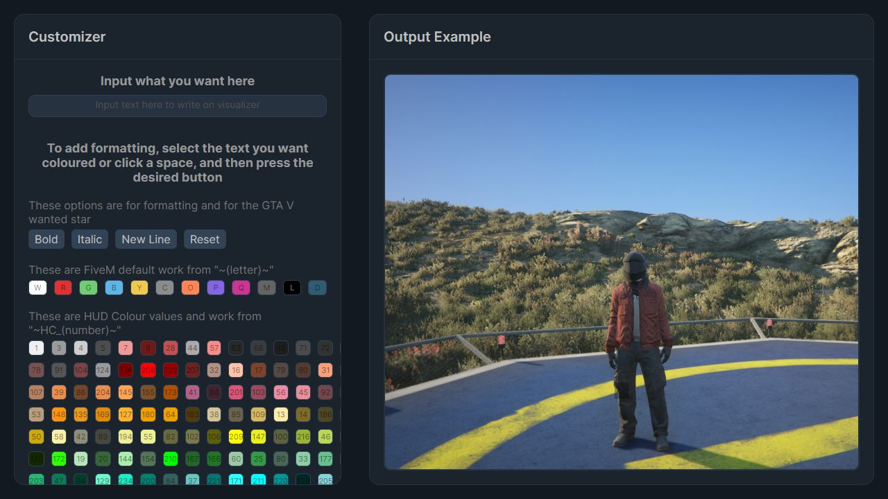
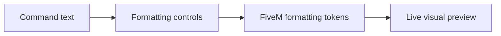

# RPUK /me Command Visualiser

<p align="center">
  <a href="https://github.com/KeyErrorFinn/rpuk-me-command-visualiser/commits/main"></a>
  <a href="https://github.com/KeyErrorFinn/rpuk-me-command-visualiser/issues"></a>
</p>

<p align="center">
  
  
  
  
  
  
</p>

A React web application for composing and previewing formatted `/me` command text used on the Roleplay UK FiveM server.

## Features

- Live preview of entered `/me` text.
- Buttons for bold, italic, new lines, resets, and wanted-star formatting.
- FiveM embedded colour codes.
- FiveM HUD colour codes.
- Custom HTML font colours.
- An example background that approximates the in-game presentation.

## How it works

`src/App.js` holds the generated preview markup and connects the two main panels:

- `Customizer` edits the command text and inserts formatting tokens around the current selection.
- `ExampleOutput` renders the formatted result.

Colour definitions are stored in `src/assets/data/`. Styling is written in SCSS under `src/styles/`. The generated production site is stored in `build/` and deployed through the workflow in `.github/workflows/static.yml`.

## Development

Requires Node.js and npm.

```bash
npm install
npm start
```

The Create React App development server opens the site with live reloading.

## Build and test

```bash
npm test
npm run build
```

The production build honours the `homepage` path in `package.json`.

## Disclaimer

This is an unofficial visualisation tool. It does not connect to FiveM or submit commands to the game, and exact rendering can vary from the live server.

## Live preview



[Open the deployed visualiser](https://git.finnley.co.uk/rpuk-me-command-visualiser/)

## Project flow


